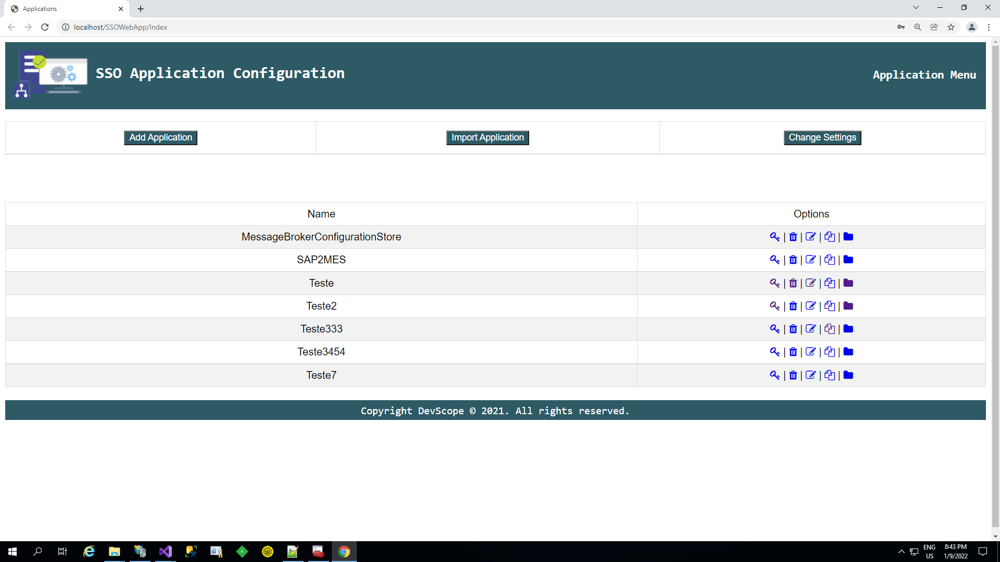
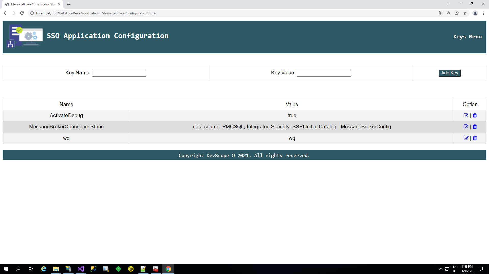

# BizTalk Server SSO Application Configuration Web Tool
BizTalk Server leverages the Enterprise Single Sign-On (SSO) capabilities for securely storing critical information such as secure configuration properties (for example, the proxy user ID, and proxy password) for the BizTalk adapters. Therefore, BizTalk Server requires SSO to work properly. BizTalk Server automatically installs SSO on every computer where you install the BizTalk Server runtime.

But the main problem of the existing tools is that all of them are Windows application tools. So, most of the times we require to access the BizTalk Server machine to read or change these values.

This tools cames to overpass this limitation:
* You can securely export and import Application configurations and it is compatible with MSFT SSO snap-in;
* You can duplicate Applications (copy and past);
* You can rename Applications;
* You can easily add new key-values;
* You can edit key-values;

THIS TOOL IS PROVIDED "AS IS", WITHOUT WARRANTY OF ANY KIND.

# About Us
**Sandro Pereira** | [DevScope](http://www.devscope.net/) | MVP & MCTS BizTalk Server 2010 | [https://blog.sandro-pereira.com/](https://blog.sandro-pereira.com/) | [@sandro_asp](https://twitter.com/sandro_asp)

**Pedro Almeida** | [DevScope](http://www.devscope.net/) | BizTalk Server Senior Consultant | [@ItsNotRcktScnce](https://twitter.com/ItsNotRcktScnce)

**Diogo Formosinho** | [DevScope](http://www.devscope.net/) | BizTalk Server Developer | [LinkedIn](https://www.linkedin.com/in/diogo-formosinho-242b221a2/)

